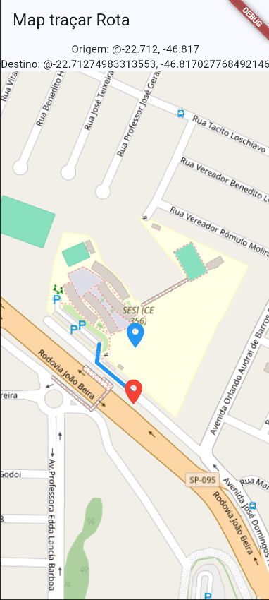

# Flutter Maps API OSRM

O app envia uma requisição com a origem e o destino para a API OSRM, que retorna um vetor de objetos com as latitudes e longitudes do trajeto. Em seguida, o Google Maps converte esses dados e desenha a rota pelas ruas do mapa, calculando também a distância em metros e quilômetros.

## Screenshot



## APK 

[Flutter Maps](/flutter_rotas_nativo/assets/flutter_rotas_nativo.apk)

## Como executar

Pré-requisito: 
- [Flutter instalado](https://docs.flutter.dev/get-started/install).
- Android Studio
- IDE (EX.: VsCode)
- Emulador ou dispositivo físico conectado

1. Clone o repositório:

   ```bash
   git clone https://github.com/EnzoToniato567/Flutter-Rotas-Nativo.git
   ```

2. Acesse a pasta do app e instale as dependências:

   ```bash
   cd Flutter-Maps/flutter_maps
   flutter pub get
   ```

3. Inicie um dispositivo ou emulador e execute:

   ```bash
   flutter run
   ```
